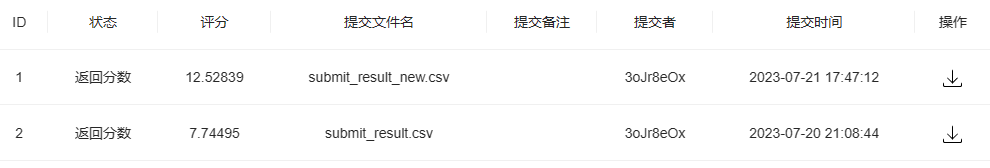
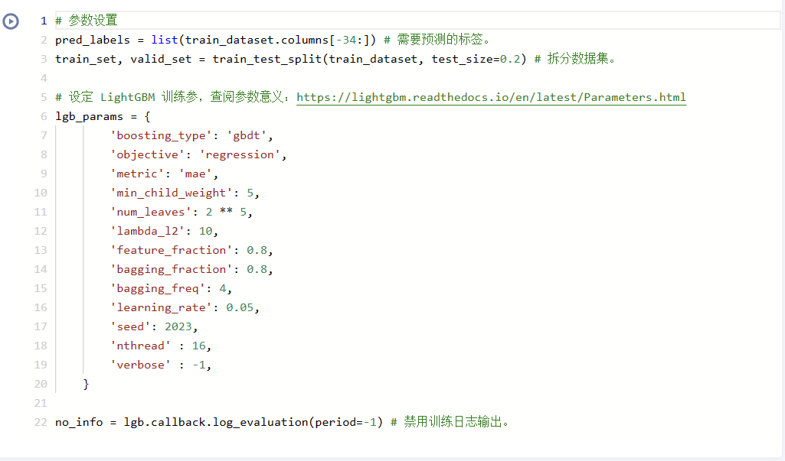
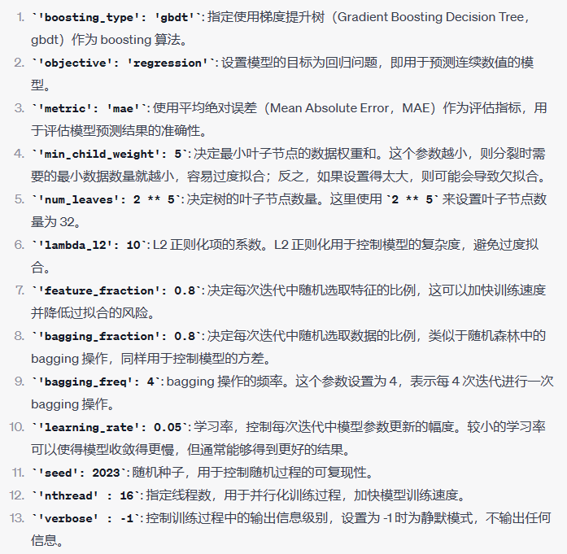

# 机器学习笔记1
**Datawhale 2023暑期学习**

PS:第一次markdown，还不熟练QAQ
## 一、项目简介

### 锂离子电池生产参数调控及生产温度预测挑战赛
[这是链接](https://challenge.xfyun.cn/topic/info?type=lithium-ion-battery&ch=ymfk4uU)

## 二、Baseline地址
[这是地址](https://aistudio.baidu.com/aistudio/projectdetail/6512066)

## 三、提交情况

### 分析
1. 第一次直接用baseline基础模型跑的
2. 第二次用baseline进阶模型跑的(不知道为什么效果反而更差了)
3. 第一次接触机器学习，完全搞不懂orz

## 四、模型参数对应

*模型参数*

*GPT分析*

## 五、疑问
1. 模型参数怎么改合适呢
2. 对LGBM不太理解

## 六、心得
1. 第一次用.md文件哈哈
2. 飞桨的ai studio线上运行平台真好用
3. 感觉到世界的层次，~~一位不知死活的小白如是说到，哈哈~~
